# ULM Processing Results

Total Acquisitions: 99

---

# Mouse 1 Acquisition 1

**Original Name:** `12_22_2022_12_03`

## Metrics

| Metric | Value |
|--------|-------|
| FRC Resolution | 21.45 μm |
| Saturation | 45.4 % |
| Mean Track Length | 33.2 frames |
| Mean Velocity | 6.64 mm/s |

## Image

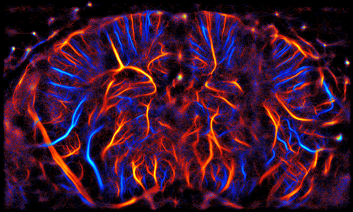

---

# Mouse 2 Acquisition 1

**Original Name:** `04_18_2023_16_00`

## Metrics

| Metric | Value |
|--------|-------|
| FRC Resolution | 24.48 μm |
| Saturation | 42.3 % |
| Mean Track Length | 36.6 frames |
| Mean Velocity | 6.60 mm/s |

## Image

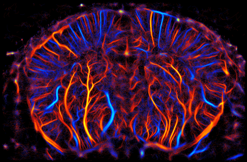

---

# Mouse 3 Acquisition 1

**Original Name:** `12_23_2022_11_57`

## Metrics

| Metric | Value |
|--------|-------|
| FRC Resolution | 25.98 μm |
| Saturation | 45.9 % |
| Mean Track Length | 32.8 frames |
| Mean Velocity | 7.18 mm/s |

## Image

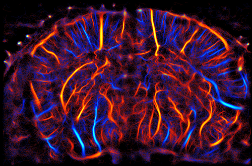

---

# Mouse 4 Acquisition 1

**Original Name:** `01_09_2023_12_21`

## Metrics

| Metric | Value |
|--------|-------|
| FRC Resolution | 29.36 μm |
| Saturation | 41.2 % |
| Mean Track Length | 33.4 frames |
| Mean Velocity | 6.76 mm/s |

## Image

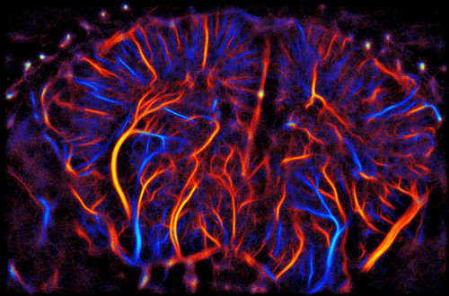

---

# Mouse 5 Acquisition 1

**Original Name:** `02_10_2023_13_11`

## Metrics

| Metric | Value |
|--------|-------|
| FRC Resolution | 24.56 μm |
| Saturation | 48.8 % |
| Mean Track Length | 34.5 frames |
| Mean Velocity | 7.53 mm/s |

## Image

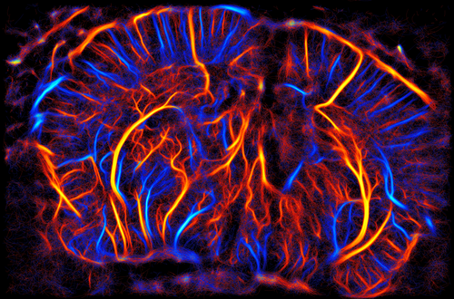

---

# Mouse 6 Acquisition 1

**Original Name:** `02_23_2023_16_47`

## Metrics

| Metric | Value |
|--------|-------|
| FRC Resolution | 21.53 μm |
| Saturation | 43.9 % |
| Mean Track Length | 31.3 frames |
| Mean Velocity | 7.37 mm/s |

## Image

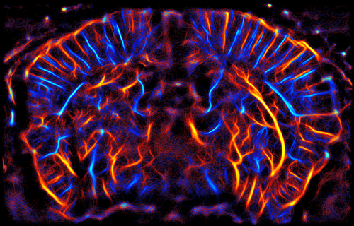

---

# Mouse 7 Acquisition 1

**Original Name:** `03_16_2023_16_38`

## Metrics

| Metric | Value |
|--------|-------|
| FRC Resolution | 21.34 μm |
| Saturation | 53.5 % |
| Mean Track Length | 37.4 frames |
| Mean Velocity | 7.08 mm/s |

## Image

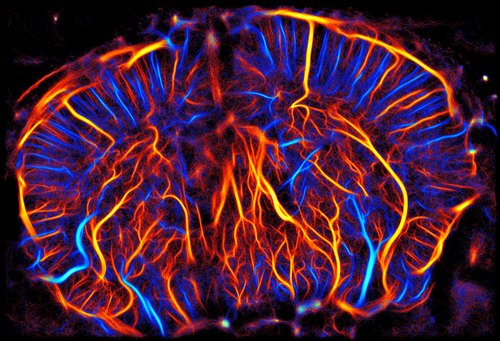

---

# Mouse 8 Acquisition 1

**Original Name:** `03_22_2023_15_11`

## Metrics

| Metric | Value |
|--------|-------|
| FRC Resolution | 23.70 μm |
| Saturation | 48.5 % |
| Mean Track Length | 34.5 frames |
| Mean Velocity | 7.02 mm/s |

## Image

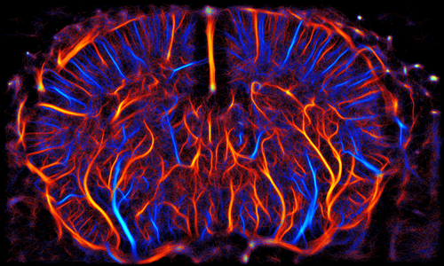

---

# Mouse 9 Acquisition 1

**Original Name:** `01_04_2024_12_18`

## Metrics

| Metric | Value |
|--------|-------|
| FRC Resolution | 21.01 μm |
| Saturation | 51.8 % |
| Mean Track Length | 35.2 frames |
| Mean Velocity | 6.86 mm/s |

## Image

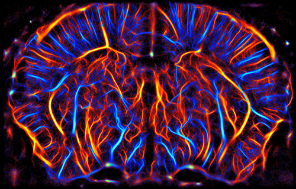

---

# Mouse 10 Acquisition 1

**Original Name:** `02_06_2024_19_04`

## Metrics

| Metric | Value |
|--------|-------|
| FRC Resolution | 24.95 μm |
| Saturation | 41.7 % |
| Mean Track Length | 35.7 frames |
| Mean Velocity | 6.67 mm/s |

## Image

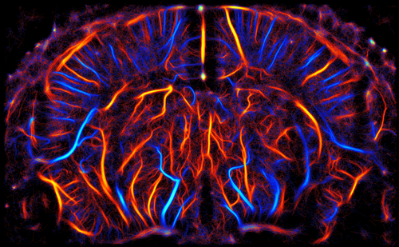

---

# Mouse 11 Acquisition 1

**Original Name:** `12_29_2023_12_30`

## Metrics

| Metric | Value |
|--------|-------|
| FRC Resolution | 16.78 μm |
| Saturation | 46.8 % |
| Mean Track Length | 37.7 frames |
| Mean Velocity | 6.52 mm/s |

## Image

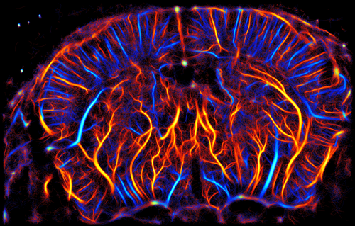

---

# Mouse 11 Acquisition 2

**Original Name:** `12_29_2023_12_47`

## Metrics

| Metric | Value |
|--------|-------|
| FRC Resolution | 17.98 μm |
| Saturation | 39.5 % |
| Mean Track Length | 36.3 frames |
| Mean Velocity | 6.33 mm/s |

## Image

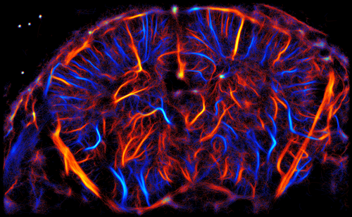

---

# Mouse 12 Acquisition 1

**Original Name:** `12_29_2023_14_51`

## Metrics

| Metric | Value |
|--------|-------|
| FRC Resolution | 20.23 μm |
| Saturation | 44.8 % |
| Mean Track Length | 36.7 frames |
| Mean Velocity | 6.76 mm/s |

## Image

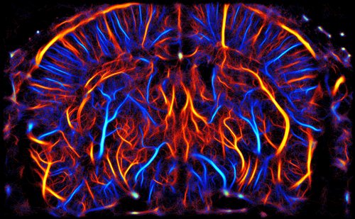

---

# Mouse 12 Acquisition 2

**Original Name:** `12_29_2023_15_09`

## Metrics

| Metric | Value |
|--------|-------|
| FRC Resolution | 17.88 μm |
| Saturation | 42.4 % |
| Mean Track Length | 37.8 frames |
| Mean Velocity | 6.22 mm/s |

## Image

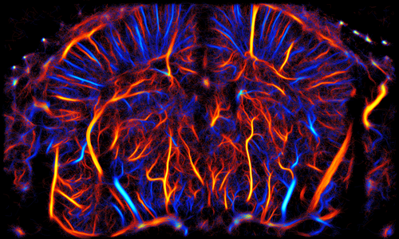

---

# Mouse 13 Acquisition 1

**Original Name:** `12_29_2023_17_07`

## Metrics

| Metric | Value |
|--------|-------|
| FRC Resolution | 23.73 μm |
| Saturation | 40.3 % |
| Mean Track Length | 36.2 frames |
| Mean Velocity | 6.50 mm/s |

## Image

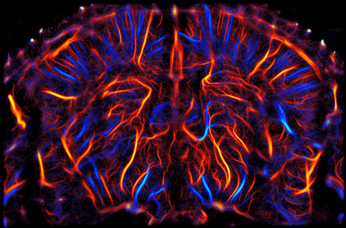

---

# Mouse 13 Acquisition 2

**Original Name:** `12_29_2023_17_24`

## Metrics

| Metric | Value |
|--------|-------|
| FRC Resolution | 16.88 μm |
| Saturation | 44.7 % |
| Mean Track Length | 37.9 frames |
| Mean Velocity | 6.21 mm/s |

## Image

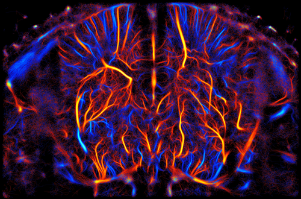

---

# Mouse 14 Acquisition 1

**Original Name:** `12_29_2023_18_37`

## Metrics

| Metric | Value |
|--------|-------|
| FRC Resolution | 21.08 μm |
| Saturation | 40.6 % |
| Mean Track Length | 37.2 frames |
| Mean Velocity | 6.52 mm/s |

## Image

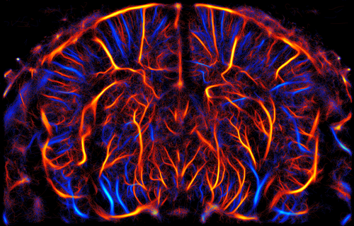

---

# Mouse 14 Acquisition 2

**Original Name:** `12_29_2023_18_54`

## Metrics

| Metric | Value |
|--------|-------|
| FRC Resolution | 23.04 μm |
| Saturation | 41.8 % |
| Mean Track Length | 37.3 frames |
| Mean Velocity | 6.57 mm/s |

## Image

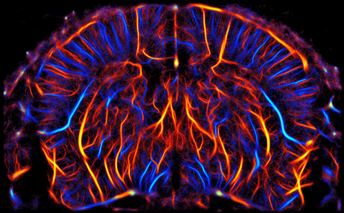

---

# Mouse 15 Acquisition 1

**Original Name:** `01_08_2024_15_25`

## Metrics

| Metric | Value |
|--------|-------|
| FRC Resolution | 22.19 μm |
| Saturation | 48.5 % |
| Mean Track Length | 35.0 frames |
| Mean Velocity | 7.00 mm/s |

## Image

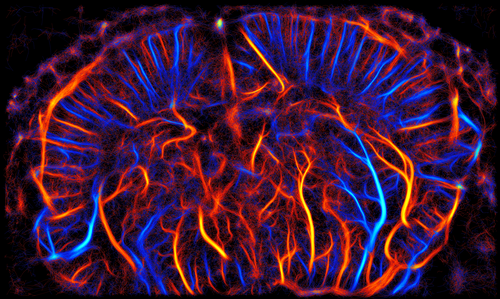

---

# Mouse 15 Acquisition 2

**Original Name:** `01_08_2024_15_39`

## Metrics

| Metric | Value |
|--------|-------|
| FRC Resolution | 23.04 μm |
| Saturation | 52.9 % |
| Mean Track Length | 36.9 frames |
| Mean Velocity | 6.84 mm/s |

## Image

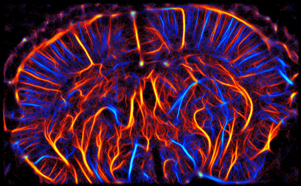

---

# Mouse 16 Acquisition 1

**Original Name:** `17_07_2024_13_40`

## Metrics

| Metric | Value |
|--------|-------|
| FRC Resolution | 20.41 μm |
| Saturation | 49.8 % |
| Mean Track Length | 36.6 frames |
| Mean Velocity | 6.89 mm/s |

## Image

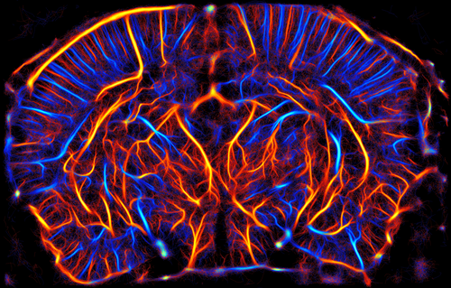

---

# Mouse 16 Acquisition 2

**Original Name:** `17_07_2024_14_01`

## Metrics

| Metric | Value |
|--------|-------|
| FRC Resolution | 20.80 μm |
| Saturation | 48.2 % |
| Mean Track Length | 37.2 frames |
| Mean Velocity | 6.72 mm/s |

## Image

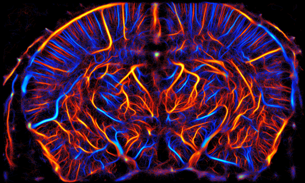

---

# Mouse 16 Acquisition 3

**Original Name:** `17_07_2024_14_22`

## Metrics

| Metric | Value |
|--------|-------|
| FRC Resolution | 22.14 μm |
| Saturation | 45.4 % |
| Mean Track Length | 37.2 frames |
| Mean Velocity | 6.77 mm/s |

## Image

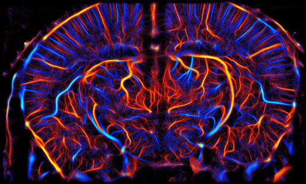

---

# Mouse 16 Acquisition 4

**Original Name:** `17_07_2024_14_40`

## Metrics

| Metric | Value |
|--------|-------|
| FRC Resolution | 23.29 μm |
| Saturation | 44.2 % |
| Mean Track Length | 37.2 frames |
| Mean Velocity | 6.48 mm/s |

## Image

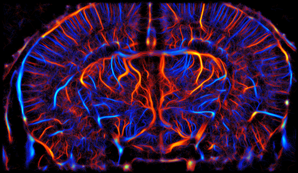

---

# Mouse 16 Acquisition 5

**Original Name:** `17_07_2024_15_03`

## Metrics

| Metric | Value |
|--------|-------|
| FRC Resolution | 24.95 μm |
| Saturation | 39.2 % |
| Mean Track Length | 36.6 frames |
| Mean Velocity | 6.94 mm/s |

## Image

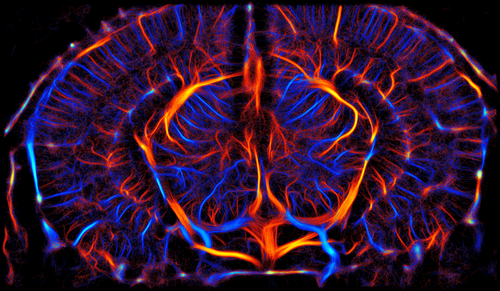

---

# Mouse 17 Acquisition 1

**Original Name:** `24_07_2024_11_06`

## Metrics

| Metric | Value |
|--------|-------|
| FRC Resolution | 21.32 μm |
| Saturation | 51.0 % |
| Mean Track Length | 35.9 frames |
| Mean Velocity | 6.83 mm/s |

## Image

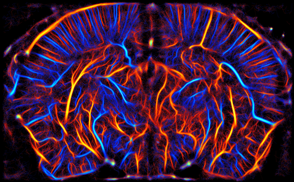

---

# Mouse 17 Acquisition 2

**Original Name:** `24_07_2024_11_26`

## Metrics

| Metric | Value |
|--------|-------|
| FRC Resolution | 22.45 μm |
| Saturation | 50.6 % |
| Mean Track Length | 38.3 frames |
| Mean Velocity | 6.19 mm/s |

## Image

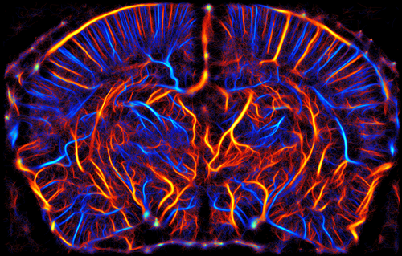

---

# Mouse 17 Acquisition 3

**Original Name:** `24_07_2024_11_48`

## Metrics

| Metric | Value |
|--------|-------|
| FRC Resolution | 24.58 μm |
| Saturation | 48.8 % |
| Mean Track Length | 38.7 frames |
| Mean Velocity | 6.04 mm/s |

## Image

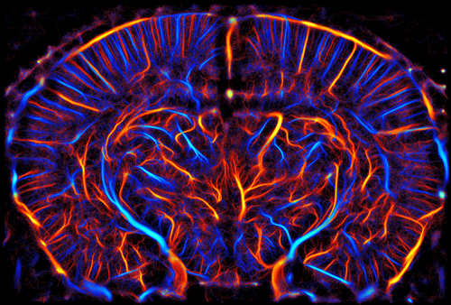

---

# Mouse 17 Acquisition 4

**Original Name:** `24_07_2024_12_07`

## Metrics

| Metric | Value |
|--------|-------|
| FRC Resolution | 27.19 μm |
| Saturation | 46.9 % |
| Mean Track Length | 38.1 frames |
| Mean Velocity | 5.81 mm/s |

## Image

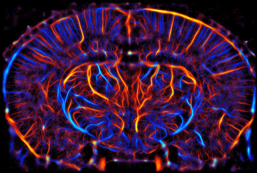

---

# Mouse 17 Acquisition 5

**Original Name:** `24_07_2024_12_25`

## Metrics

| Metric | Value |
|--------|-------|
| FRC Resolution | 29.77 μm |
| Saturation | 36.9 % |
| Mean Track Length | 35.7 frames |
| Mean Velocity | 6.38 mm/s |

## Image

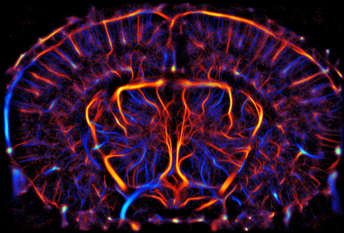

---

# Mouse 17 Acquisition 6

**Original Name:** `24_07_2024_12_41`

## Metrics

| Metric | Value |
|--------|-------|
| FRC Resolution | 28.90 μm |
| Saturation | 39.1 % |
| Mean Track Length | 37.9 frames |
| Mean Velocity | 6.25 mm/s |

## Image

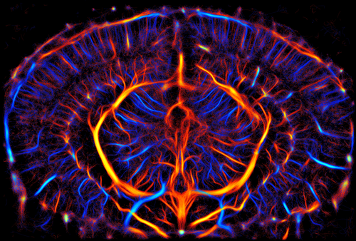

---

# Mouse 18 Acquisition 1

**Original Name:** `24_07_2024_15_55`

## Metrics

| Metric | Value |
|--------|-------|
| FRC Resolution | 20.70 μm |
| Saturation | 54.0 % |
| Mean Track Length | 39.1 frames |
| Mean Velocity | 6.45 mm/s |

## Image

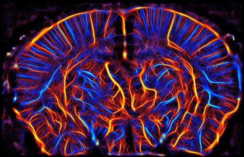

---

# Mouse 18 Acquisition 2

**Original Name:** `24_07_2024_16_12`

## Metrics

| Metric | Value |
|--------|-------|
| FRC Resolution | 19.39 μm |
| Saturation | 52.2 % |
| Mean Track Length | 39.7 frames |
| Mean Velocity | 6.26 mm/s |

## Image

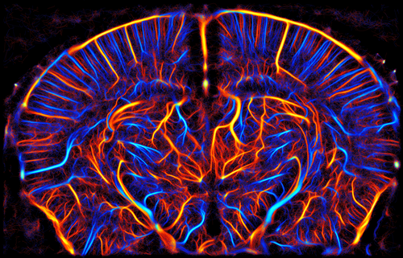

---

# Mouse 18 Acquisition 3

**Original Name:** `24_07_2024_16_29`

## Metrics

| Metric | Value |
|--------|-------|
| FRC Resolution | 20.14 μm |
| Saturation | 49.7 % |
| Mean Track Length | 39.4 frames |
| Mean Velocity | 6.29 mm/s |

## Image

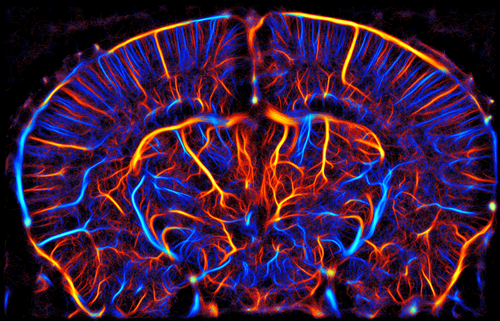

---

# Mouse 18 Acquisition 4

**Original Name:** `24_07_2024_16_48`

## Metrics

| Metric | Value |
|--------|-------|
| FRC Resolution | 23.05 μm |
| Saturation | 49.6 % |
| Mean Track Length | 38.9 frames |
| Mean Velocity | 6.26 mm/s |

## Image

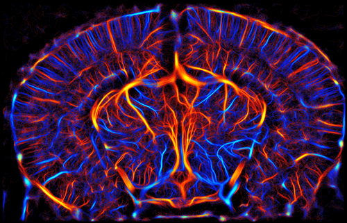

---

# Mouse 18 Acquisition 5

**Original Name:** `24_07_2024_17_10`

## Metrics

| Metric | Value |
|--------|-------|
| FRC Resolution | 23.87 μm |
| Saturation | 49.8 % |
| Mean Track Length | 38.1 frames |
| Mean Velocity | 6.74 mm/s |

## Image

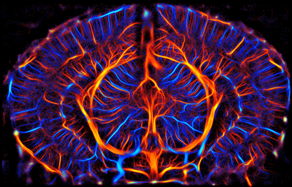

---

# Mouse 18 Acquisition 6

**Original Name:** `24_07_2024_17_26`

## Metrics

| Metric | Value |
|--------|-------|
| FRC Resolution | 23.54 μm |
| Saturation | 46.4 % |
| Mean Track Length | 38.3 frames |
| Mean Velocity | 6.65 mm/s |

## Image

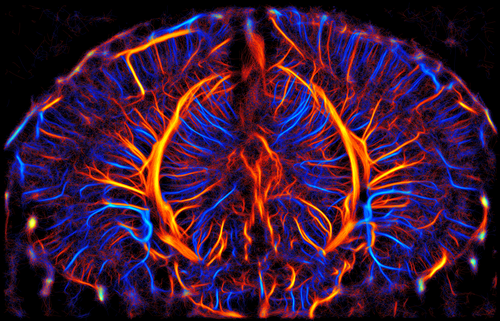

---

# Mouse 19 Acquisition 1

**Original Name:** `01_08_2024_09_22`

## Metrics

| Metric | Value |
|--------|-------|
| FRC Resolution | 23.46 μm |
| Saturation | 49.9 % |
| Mean Track Length | 36.4 frames |
| Mean Velocity | 6.91 mm/s |

## Image

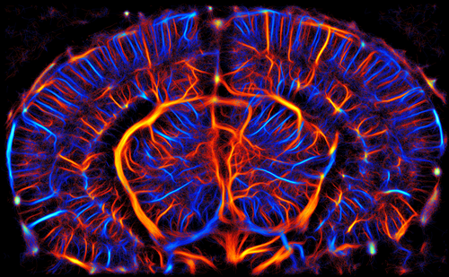

---

# Mouse 19 Acquisition 2

**Original Name:** `01_08_2024_09_44`

## Metrics

| Metric | Value |
|--------|-------|
| FRC Resolution | 41.70 μm |
| Saturation | 28.4 % |
| Mean Track Length | 29.4 frames |
| Mean Velocity | 8.14 mm/s |

## Image

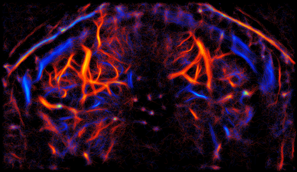

---

# Mouse 19 Acquisition 3

**Original Name:** `01_08_2024_10_01`

## Metrics

| Metric | Value |
|--------|-------|
| FRC Resolution | 32.90 μm |
| Saturation | 36.0 % |
| Mean Track Length | 31.4 frames |
| Mean Velocity | 8.02 mm/s |

## Image

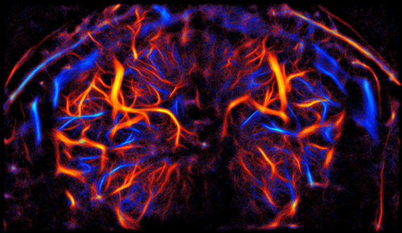

---

# Mouse 20 Acquisition 1

**Original Name:** `01_08_2024_12_00`

## Metrics

| Metric | Value |
|--------|-------|
| FRC Resolution | 29.25 μm |
| Saturation | 36.1 % |
| Mean Track Length | 31.3 frames |
| Mean Velocity | 7.72 mm/s |

## Image

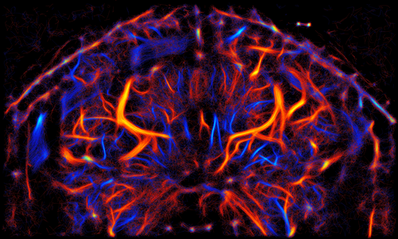

---

# Mouse 20 Acquisition 2

**Original Name:** `01_08_2024_12_21`

## Metrics

| Metric | Value |
|--------|-------|
| FRC Resolution | 35.46 μm |
| Saturation | 24.4 % |
| Mean Track Length | 29.6 frames |
| Mean Velocity | 7.83 mm/s |

## Image

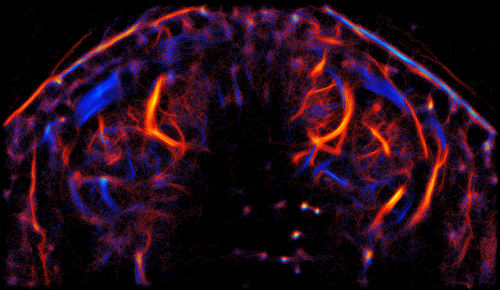

---

# Mouse 20 Acquisition 3

**Original Name:** `01_08_2024_12_42`

## Metrics

| Metric | Value |
|--------|-------|
| FRC Resolution | 27.29 μm |
| Saturation | 23.4 % |
| Mean Track Length | 31.9 frames |
| Mean Velocity | 6.66 mm/s |

## Image

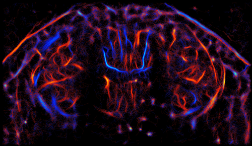

---

# Mouse 20 Acquisition 4

**Original Name:** `01_08_2024_13_03`

## Metrics

| Metric | Value |
|--------|-------|
| FRC Resolution | 25.42 μm |
| Saturation | 27.3 % |
| Mean Track Length | 31.7 frames |
| Mean Velocity | 6.55 mm/s |

## Image

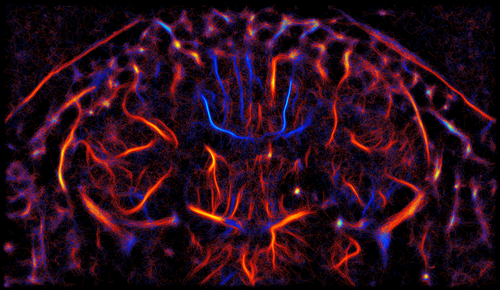

---

# Mouse 21 Acquisition 1

**Original Name:** `01_08_2024_15_23`

## Metrics

| Metric | Value |
|--------|-------|
| FRC Resolution | 27.56 μm |
| Saturation | 41.5 % |
| Mean Track Length | 30.4 frames |
| Mean Velocity | 7.32 mm/s |

## Image

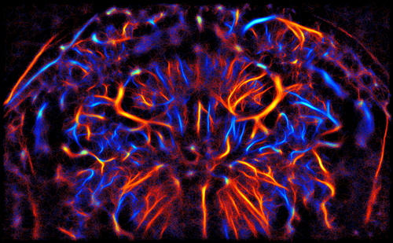

---

# Mouse 21 Acquisition 2

**Original Name:** `01_08_2024_15_44`

## Metrics

| Metric | Value |
|--------|-------|
| FRC Resolution | 34.49 μm |
| Saturation | 26.4 % |
| Mean Track Length | 29.6 frames |
| Mean Velocity | 7.24 mm/s |

## Image

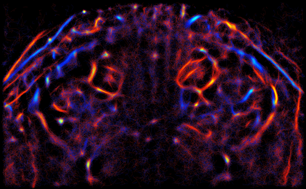

---

# Mouse 22 Acquisition 1

**Original Name:** `03_22_2023_17_19`

## Metrics

| Metric | Value |
|--------|-------|
| FRC Resolution | 19.87 μm |
| Saturation | 52.5 % |
| Mean Track Length | 34.7 frames |
| Mean Velocity | 7.03 mm/s |

## Image

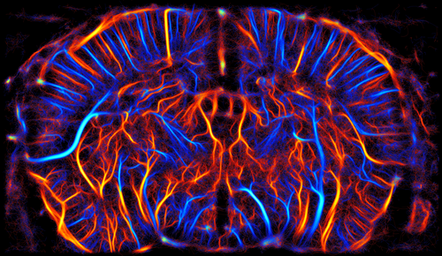

---

# Mouse 23 Acquisition 1

**Original Name:** `03_25_2023_16_10`

## Metrics

| Metric | Value |
|--------|-------|
| FRC Resolution | 24.09 μm |
| Saturation | 50.6 % |
| Mean Track Length | 33.1 frames |
| Mean Velocity | 7.03 mm/s |

## Image

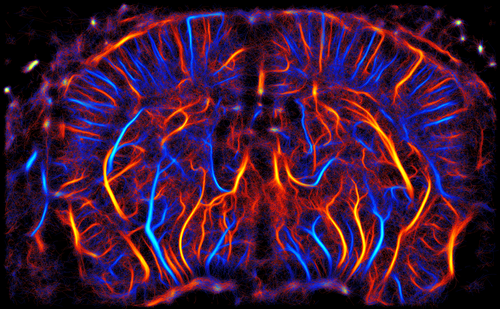

---

# Mouse 24 Acquisition 1

**Original Name:** `04_04_2023_12_39`

## Metrics

| Metric | Value |
|--------|-------|
| FRC Resolution | 24.66 μm |
| Saturation | 45.4 % |
| Mean Track Length | 31.5 frames |
| Mean Velocity | 6.97 mm/s |

## Image

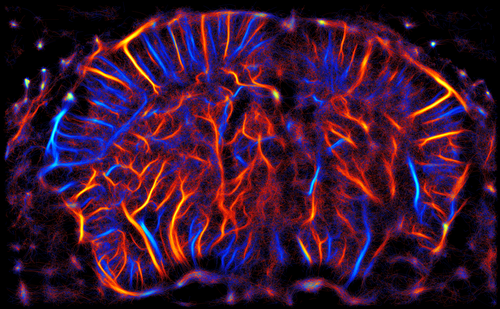

---

# Mouse 25 Acquisition 1

**Original Name:** `02_06_2024_16_47`

## Metrics

| Metric | Value |
|--------|-------|
| FRC Resolution | 23.12 μm |
| Saturation | 51.5 % |
| Mean Track Length | 35.0 frames |
| Mean Velocity | 6.69 mm/s |

## Image

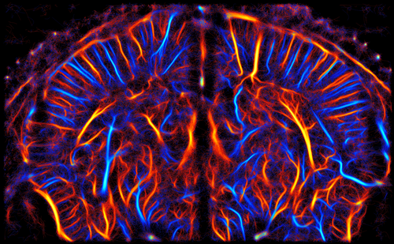

---

# Mouse 26 Acquisition 1

**Original Name:** `02_03_2024_17_25`

## Metrics

| Metric | Value |
|--------|-------|
| FRC Resolution | 23.82 μm |
| Saturation | 47.8 % |
| Mean Track Length | 36.9 frames |
| Mean Velocity | 6.90 mm/s |

## Image

---

# Mouse 27 Acquisition 1

**Original Name:** `02_03_2024_19_20`

## Metrics

| Metric | Value |
|--------|-------|
| FRC Resolution | 23.04 μm |
| Saturation | 45.1 % |
| Mean Track Length | 38.8 frames |
| Mean Velocity | 7.12 mm/s |

## Image

---

# Mouse 28 Acquisition 1

**Original Name:** `02_05_2024_15_54`

## Metrics

| Metric | Value |
|--------|-------|
| FRC Resolution | 26.41 μm |
| Saturation | 42.6 % |
| Mean Track Length | 35.9 frames |
| Mean Velocity | 6.65 mm/s |

## Image

---

# Mouse 29 Acquisition 1

**Original Name:** `02_06_2024_11_07`

## Metrics

| Metric | Value |
|--------|-------|
| FRC Resolution | 25.55 μm |
| Saturation | 46.4 % |
| Mean Track Length | 36.1 frames |
| Mean Velocity | 6.66 mm/s |

## Image

---

# Mouse 30 Acquisition 1

**Original Name:** `05_03_2023_13_48`

## Metrics

| Metric | Value |
|--------|-------|
| FRC Resolution | 27.93 μm |
| Saturation | 45.2 % |
| Mean Track Length | 34.9 frames |
| Mean Velocity | 6.86 mm/s |

## Image

---

# Mouse 31 Acquisition 1

**Original Name:** `07_18_2023_15_47`

## Metrics

| Metric | Value |
|--------|-------|
| FRC Resolution | 20.56 μm |
| Saturation | 48.3 % |
| Mean Track Length | 38.5 frames |
| Mean Velocity | 6.99 mm/s |

## Image

---

# Mouse 32 Acquisition 1

**Original Name:** `04_20_2023_16_12`

## Metrics

| Metric | Value |
|--------|-------|
| FRC Resolution | 19.54 μm |
| Saturation | 49.6 % |
| Mean Track Length | 33.2 frames |
| Mean Velocity | 6.79 mm/s |

## Image

---

# Mouse 33 Acquisition 1

**Original Name:** `03_25_2023_18_13`

## Metrics

| Metric | Value |
|--------|-------|
| FRC Resolution | 29.68 μm |
| Saturation | 40.6 % |
| Mean Track Length | 35.1 frames |
| Mean Velocity | 6.85 mm/s |

## Image

---

# Mouse 33 Acquisition 2

**Original Name:** `03_25_2023_18_31`

## Metrics

| Metric | Value |
|--------|-------|
| FRC Resolution | 34.40 μm |
| Saturation | 42.3 % |
| Mean Track Length | 35.0 frames |
| Mean Velocity | 7.03 mm/s |

## Image

---

# Mouse 34 Acquisition 1

**Original Name:** `05_03_2023_10_08`

## Metrics

| Metric | Value |
|--------|-------|
| FRC Resolution | 24.26 μm |
| Saturation | 46.3 % |
| Mean Track Length | 34.4 frames |
| Mean Velocity | 6.78 mm/s |

## Image

---

# Mouse 35 Acquisition 1

**Original Name:** `02_22_2023_14_41`

## Metrics

| Metric | Value |
|--------|-------|
| FRC Resolution | 21.40 μm |
| Saturation | 60.8 % |
| Mean Track Length | 43.6 frames |
| Mean Velocity | 6.02 mm/s |

## Image

---

# Mouse 36 Acquisition 1

**Original Name:** `02_22_2023_16_47`

## Metrics

| Metric | Value |
|--------|-------|
| FRC Resolution | 20.07 μm |
| Saturation | 60.7 % |
| Mean Track Length | 35.6 frames |
| Mean Velocity | 6.79 mm/s |

## Image

---

# Mouse 36 Acquisition 2

**Original Name:** `02_22_2023_17_20`

## Metrics

| Metric | Value |
|--------|-------|
| FRC Resolution | 22.20 μm |
| Saturation | 56.3 % |
| Mean Track Length | 38.2 frames |
| Mean Velocity | 7.12 mm/s |

## Image

---

# Mouse 37 Acquisition 1

**Original Name:** `02_22_2023_18_31`

## Metrics

| Metric | Value |
|--------|-------|
| FRC Resolution | 22.75 μm |
| Saturation | 60.8 % |
| Mean Track Length | 33.9 frames |
| Mean Velocity | 6.77 mm/s |

## Image

---

# Mouse 37 Acquisition 2

**Original Name:** `02_22_2023_19_02`

## Metrics

| Metric | Value |
|--------|-------|
| FRC Resolution | 23.48 μm |
| Saturation | 53.0 % |
| Mean Track Length | 38.7 frames |
| Mean Velocity | 6.45 mm/s |

## Image

---

# Mouse 38 Acquisition 1

**Original Name:** `02_22_2023_19_48`

## Metrics

| Metric | Value |
|--------|-------|
| FRC Resolution | 23.35 μm |
| Saturation | 59.3 % |
| Mean Track Length | 35.1 frames |
| Mean Velocity | 6.77 mm/s |

## Image

---

# Mouse 38 Acquisition 2

**Original Name:** `02_22_2023_20_15`

## Metrics

| Metric | Value |
|--------|-------|
| FRC Resolution | 24.57 μm |
| Saturation | 57.9 % |
| Mean Track Length | 35.5 frames |
| Mean Velocity | 7.01 mm/s |

## Image

---

# Mouse 39 Acquisition 1

**Original Name:** `10_46_51`

## Metrics

| Metric | Value |
|--------|-------|
| FRC Resolution | 35.57 μm |
| Saturation | 11.4 % |
| Mean Track Length | 20.7 frames |
| Mean Velocity | 16.47 mm/s |

## Image

---

# Mouse 40 Acquisition 1

**Original Name:** `12_39_56`

## Metrics

| Metric | Value |
|--------|-------|
| FRC Resolution | 41.46 μm |
| Saturation | 8.4 % |
| Mean Track Length | 21.5 frames |
| Mean Velocity | 17.63 mm/s |

## Image

---

# Mouse 41 Acquisition 1

**Original Name:** `14_39_32`

## Metrics

| Metric | Value |
|--------|-------|
| FRC Resolution | 42.55 μm |
| Saturation | 11.9 % |
| Mean Track Length | 20.4 frames |
| Mean Velocity | 16.36 mm/s |

## Image

---

# Mouse 42 Acquisition 1

**Original Name:** `fus_June_01_2023_12_44_06`

## Metrics

| Metric | Value |
|--------|-------|
| FRC Resolution | 16.90 μm |
| Saturation | 43.4 % |
| Mean Track Length | 41.7 frames |
| Mean Velocity | 6.68 mm/s |

## Image

---

# Mouse 42 Acquisition 2

**Original Name:** `fus_June_01_2023_12_51_46`

## Metrics

| Metric | Value |
|--------|-------|
| FRC Resolution | 14.21 μm |
| Saturation | 43.9 % |
| Mean Track Length | 37.5 frames |
| Mean Velocity | 6.85 mm/s |

## Image

---

# Mouse 43 Acquisition 1

**Original Name:** `11_06_2024_11_15_00`

## Metrics

| Metric | Value |
|--------|-------|
| FRC Resolution | 46.47 μm |
| Saturation | 24.1 % |
| Mean Track Length | 29.8 frames |
| Mean Velocity | 10.99 mm/s |

## Image

---

# Mouse 44 Acquisition 1

**Original Name:** `11_06_2024_14_45_00`

## Metrics

| Metric | Value |
|--------|-------|
| FRC Resolution | 58.76 μm |
| Saturation | 26.7 % |
| Mean Track Length | 29.2 frames |
| Mean Velocity | 11.61 mm/s |

## Image

---

# Mouse 45 Acquisition 1

**Original Name:** `25_04_2024_11_49_00`

## Metrics

| Metric | Value |
|--------|-------|
| FRC Resolution | 47.29 μm |
| Saturation | 33.2 % |
| Mean Track Length | 31.0 frames |
| Mean Velocity | 10.31 mm/s |

## Image

---

# Mouse 46 Acquisition 1

**Original Name:** `25_04_2024_15_25_00`

## Metrics

| Metric | Value |
|--------|-------|
| FRC Resolution | 61.48 μm |
| Saturation | 31.4 % |
| Mean Track Length | 30.3 frames |
| Mean Velocity | 10.54 mm/s |

## Image

---

# Mouse 47 Acquisition 1

**Original Name:** `11_08_2024_11_37_00`

## Metrics

| Metric | Value |
|--------|-------|
| FRC Resolution | 65.51 μm |
| Saturation | 13.0 % |
| Mean Track Length | 27.8 frames |
| Mean Velocity | 11.81 mm/s |

## Image

---

# Mouse 48 Acquisition 1

**Original Name:** `11_08_2024_14_47_00`

## Metrics

| Metric | Value |
|--------|-------|
| FRC Resolution | 55.50 μm |
| Saturation | 29.0 % |
| Mean Track Length | 28.7 frames |
| Mean Velocity | 11.49 mm/s |

## Image

---

# Mouse 49 Acquisition 1

**Original Name:** `17_01_2025_13_08_00`

## Metrics

| Metric | Value |
|--------|-------|
| FRC Resolution | 55.12 μm |
| Saturation | 20.4 % |
| Mean Track Length | 30.0 frames |
| Mean Velocity | 10.95 mm/s |

## Image

---

# Mouse 50 Acquisition 1

**Original Name:** `17_01_2025_16_32_00`

## Metrics

| Metric | Value |
|--------|-------|
| FRC Resolution | 66.60 μm |
| Saturation | 22.0 % |
| Mean Track Length | 31.5 frames |
| Mean Velocity | 10.97 mm/s |

## Image

---

# Mouse 51 Acquisition 1

**Original Name:** `15_01_2025_15_01_00`

## Metrics

| Metric | Value |
|--------|-------|
| FRC Resolution | 40.36 μm |
| Saturation | 24.6 % |
| Mean Track Length | 28.9 frames |
| Mean Velocity | 11.49 mm/s |

## Image

---

# Mouse 52 Acquisition 1

**Original Name:** `15_01_2025_18_09_00`

## Metrics

| Metric | Value |
|--------|-------|
| FRC Resolution | 54.74 μm |
| Saturation | 26.2 % |
| Mean Track Length | 30.5 frames |
| Mean Velocity | 10.91 mm/s |

## Image

---

# Mouse 53 Acquisition 1

**Original Name:** `16_01_2025_13_15_00`

## Metrics

| Metric | Value |
|--------|-------|
| FRC Resolution | 57.50 μm |
| Saturation | 16.2 % |
| Mean Track Length | 29.1 frames |
| Mean Velocity | 11.73 mm/s |

## Image

---

# Mouse 54 Acquisition 1

**Original Name:** `16_01_2025_16_36_00`

## Metrics

| Metric | Value |
|--------|-------|
| FRC Resolution | 55.12 μm |
| Saturation | 27.7 % |
| Mean Track Length | 31.4 frames |
| Mean Velocity | 10.77 mm/s |

## Image

---

# Mouse 55 Acquisition 1

**Original Name:** `fUS_February_17_2022_17_20_56`

## Metrics

| Metric | Value |
|--------|-------|
| FRC Resolution | 15.94 μm |
| Saturation | 47.3 % |
| Mean Track Length | 36.0 frames |
| Mean Velocity | 6.32 mm/s |

## Image

---

# Mouse 55 Acquisition 2

**Original Name:** `fUS_February_17_2022_17_30_33`

## Metrics

| Metric | Value |
|--------|-------|
| FRC Resolution | 23.33 μm |
| Saturation | 34.2 % |
| Mean Track Length | 41.2 frames |
| Mean Velocity | 6.47 mm/s |

## Image

---

# Mouse 56 Acquisition 1

**Original Name:** `fUS_February_18_2022_11_54_01`

## Metrics

| Metric | Value |
|--------|-------|
| FRC Resolution | 16.95 μm |
| Saturation | 52.7 % |
| Mean Track Length | 34.3 frames |
| Mean Velocity | 6.69 mm/s |

## Image

---

# Mouse 56 Acquisition 2

**Original Name:** `fUS_February_18_2022_12_00_50`

## Metrics

| Metric | Value |
|--------|-------|
| FRC Resolution | 20.42 μm |
| Saturation | 50.0 % |
| Mean Track Length | 42.0 frames |
| Mean Velocity | 6.37 mm/s |

## Image

---

# Mouse 56 Acquisition 3

**Original Name:** `fUS_February_18_2022_12_22_35`

## Metrics

| Metric | Value |
|--------|-------|
| FRC Resolution | 17.67 μm |
| Saturation | 49.7 % |
| Mean Track Length | 38.4 frames |
| Mean Velocity | 6.45 mm/s |

## Image

---

# Mouse 57 Acquisition 1

**Original Name:** `fUS_March_11_2022_11_50_32`

## Metrics

| Metric | Value |
|--------|-------|
| FRC Resolution | 18.84 μm |
| Saturation | 44.3 % |
| Mean Track Length | 36.5 frames |
| Mean Velocity | 6.72 mm/s |

## Image

---

# Mouse 57 Acquisition 2

**Original Name:** `fUS_March_11_2022_12_13_30`

## Metrics

| Metric | Value |
|--------|-------|
| FRC Resolution | 20.64 μm |
| Saturation | 44.4 % |
| Mean Track Length | 32.8 frames |
| Mean Velocity | 6.73 mm/s |

## Image

---

# Mouse 58 Acquisition 1

**Original Name:** `fUS_June_22_2022_15_47_21`

## Metrics

| Metric | Value |
|--------|-------|
| FRC Resolution | 15.28 μm |
| Saturation | 31.8 % |
| Mean Track Length | 35.7 frames |
| Mean Velocity | 9.02 mm/s |

## Image

---

# Mouse 59 Acquisition 1

**Original Name:** `fUS_June_23_2022_13_07_39`

## Metrics

| Metric | Value |
|--------|-------|
| FRC Resolution | 16.12 μm |
| Saturation | 30.5 % |
| Mean Track Length | 38.1 frames |
| Mean Velocity | 7.69 mm/s |

## Image

---

# Mouse 59 Acquisition 2

**Original Name:** `fUS_June_23_2022_13_41_03`

## Metrics

| Metric | Value |
|--------|-------|
| FRC Resolution | 17.10 μm |
| Saturation | 31.0 % |
| Mean Track Length | 36.3 frames |
| Mean Velocity | 7.87 mm/s |

## Image

---

# Mouse 59 Acquisition 3

**Original Name:** `fUS_June_23_2022_13_50_36`

## Metrics

| Metric | Value |
|--------|-------|
| FRC Resolution | 19.95 μm |
| Saturation | 32.4 % |
| Mean Track Length | 38.4 frames |
| Mean Velocity | 8.15 mm/s |

## Image

---

# Mouse 60 Acquisition 1

**Original Name:** `02_04_2025_12_31`

## Metrics

| Metric | Value |
|--------|-------|
| FRC Resolution | 22.07 μm |
| Saturation | 53.2 % |
| Mean Track Length | 34.9 frames |
| Mean Velocity | 6.98 mm/s |

## Image

---

# Mouse 60 Acquisition 2

**Original Name:** `02_04_2025_12_50`

## Metrics

| Metric | Value |
|--------|-------|
| FRC Resolution | 21.57 μm |
| Saturation | 52.2 % |
| Mean Track Length | 37.6 frames |
| Mean Velocity | 6.43 mm/s |

## Image

---

# Mouse 60 Acquisition 3

**Original Name:** `02_04_2025_13_19`

## Metrics

| Metric | Value |
|--------|-------|
| FRC Resolution | 18.95 μm |
| Saturation | 42.9 % |
| Mean Track Length | 36.6 frames |
| Mean Velocity | 6.94 mm/s |

## Image

---

# Mouse 61 Acquisition 1

**Original Name:** `2025_02_04_16_25`

## Metrics

| Metric | Value |
|--------|-------|
| FRC Resolution | 18.35 μm |
| Saturation | 51.6 % |
| Mean Track Length | 37.8 frames |
| Mean Velocity | 6.74 mm/s |

## Image

---

